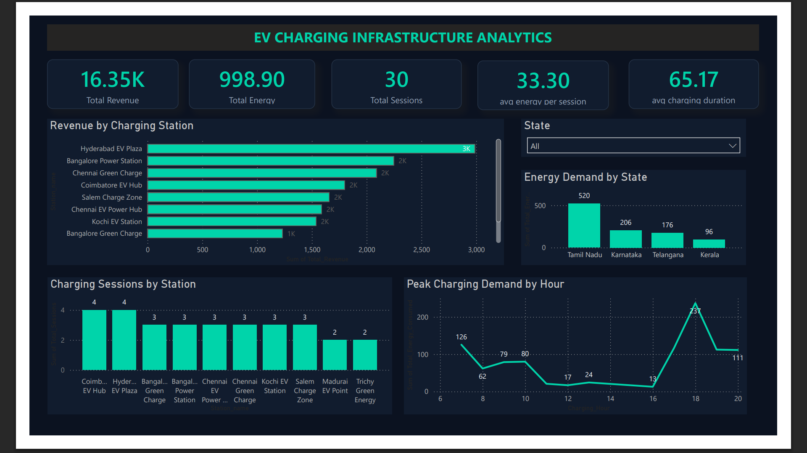
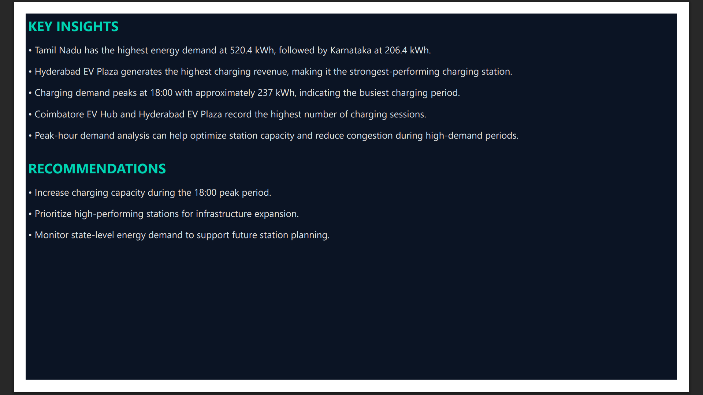

# Power BI Dashboard

This folder contains the Power BI dashboard developed as part of the **EV Charging Analytics** project.

## Dashboard Overview

The dashboard provides an interactive analysis of:

- Total charging revenue
- Total energy consumption
- Total charging sessions
- Average energy consumed per session
- Average charging duration
- Charging station revenue performance
- State-level energy demand
- Charging sessions by station
- Peak charging demand by hour
- Interactive state filtering

## Dashboard Preview

## Insights & Recommendations

The analysis identified key business insights related to charging demand, station performance, and state-level energy consumption.

## Tools Used

- Power BI Desktop
- DAX
- MySQL
- SQL

## Related SQL Analysis

The SQL analysis used to prepare and analyze the EV charging data is available in the [`SQL`](../SQL/ev_charging_analytics.sql) folder.

## Project Repository

This Power BI dashboard is part of the complete **EV Charging Analytics** project, which combines SQL-based data analysis with Power BI visualization.
